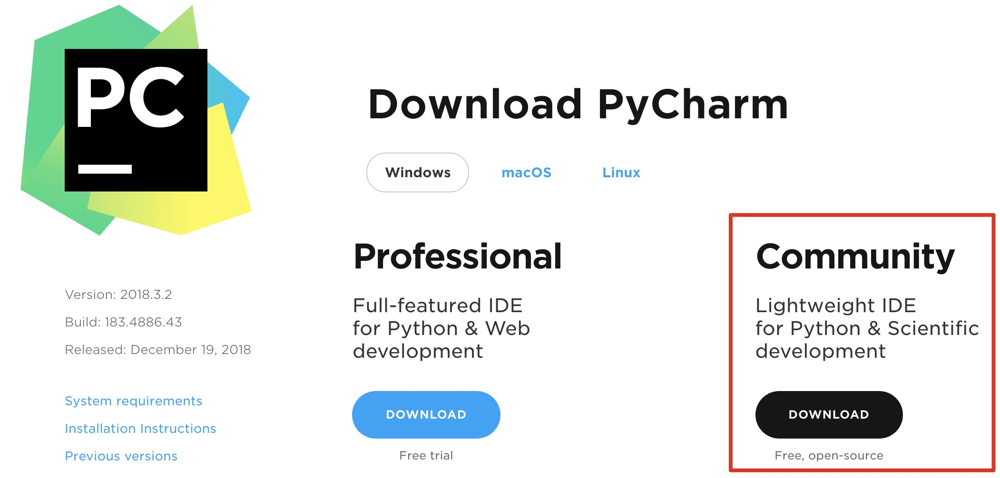
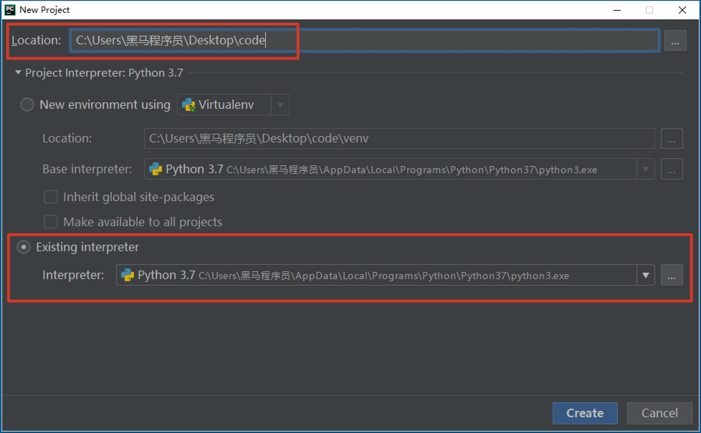
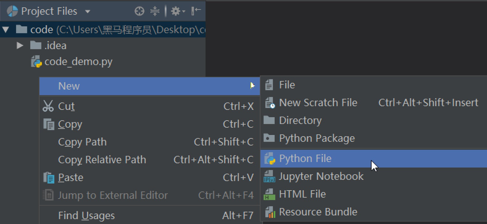
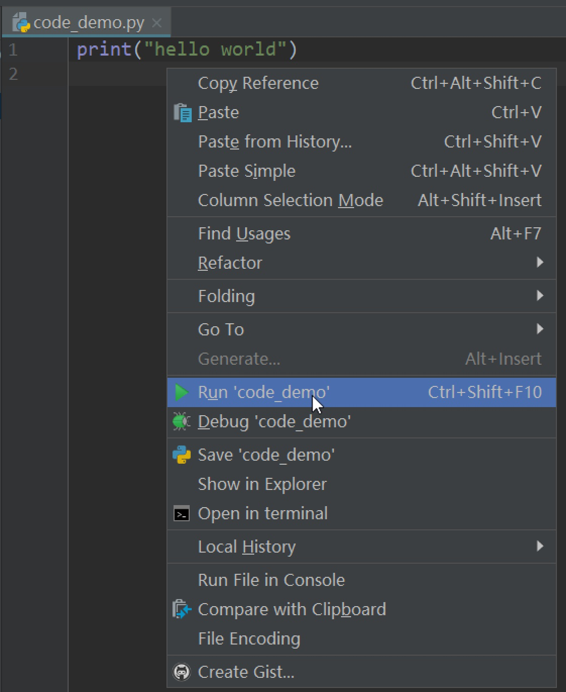

# 课程：PyCharm

# 课程目标

- PyCharm的作用
- 下载安装PyCharm
- PyCharm的基本使用
- PyCharm的基本设置

# 一. PyCharm的作用

PyCharm是一种Python ==IDE==（集成开发环境），带有一整套可以帮助用户在使用Python语言开发时==提高其效率的工具==，内部集成的功能如下：

- Project管理
- 智能提示
- 语法高亮
- 代码跳转
- 调试代码
- 解释代码(解释器)
- 框架和库
- ......

> PythonCharm分为专业版（professional）和社区版（community），本视频以社区版为基准进行操作和讲解。

# 二. 下载和安装

## 2.1 下载

下载地址：http://www.jetbrains.com/pycharm/download/#section=windows



> 注意：这里选择Community(社区版)下载，专业版是收费版本，社区版可以满足我们基础编程需求。


## 2.2 安装

双击安装包 -- [运行] -- [允许你应用更改设备]: [是] -- [Next] -- [选择安装位置] -- [Next] -- [Install] -- [Finish]。


# 三. PyCharm基本使用

## 3.1 新建项目

打开PyCharm -- [Create New Project] -- 选择项目根目录和解释器版本 -- [Create]，即可完成新建一个项目。




## 3.2 新建文件并书写代码

项目根目录或根目录内部任意位置 — 右键 -- [New] -- [Python File] -- 输入文件名 -- [OK]

> 如果是将来要上传到服务器的文件，那么文件名切记不能用中文。



双击打开文件，并书写一个最简单的Python代码：

``` python
print("hello world")
```


## 3.3 运行文件

文件打开状态 -- 空白位置 — 右键 -- Run -- 即可调出Pycharm的控制台输出程序结果。



# 四. PyCharm的基本设置

[file] -- [Settings]/[Default Settings]。


## 4.1 修改主题

[Appearance & Behavior] -- [Appearance]


- Theme：修改主题
- Name：修改主题字体
- Size：修改主题字号

## 4.2 修改代码文字格式

[Editor] -- [Font]

- Font：修改字体
- Size：修改字号
- Line Spacing：修改行间距

## 4.3 修改解释器

[Project: 项目名称] -- [Project Interpreter] -- [设置图标] -- [Add] -- 浏览到目标解释器 -- [OK] -- [OK]。

## 4.4 项目管理

### 4.4.1 打开项目

[File] -- [Open] -- 浏览选择目标项目根目录 -- [OK] -- 选择打开项目方式。

打开项目的方式共三种，分别如下：


1. This Window 

覆盖当前项目，从而打开目标项目

2. New Window

在新窗口打开，则打开两次PyCharm，每个PyCharm负责一个项目。


3. Attach


### 4.4.2 关闭项目

[File] -- [Close Project]/[Close Projects in current window]

# 总结

- PyCharm新建文件

项目管理空白位置 — 右键 -- New -- PythonFile

- 运行文件

代码内部 — 右键 -- Run

- 修改代码文字格式

[file] -- [Settings]/[Default Settings] -- [Editor] -- [Font]